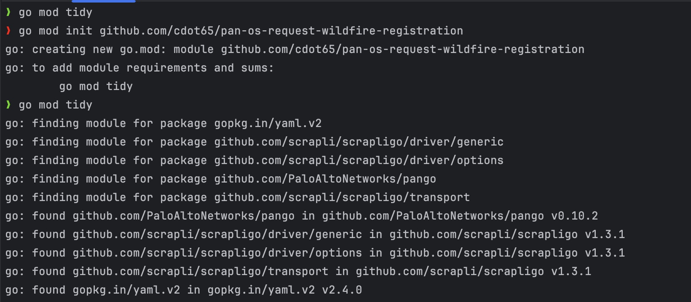
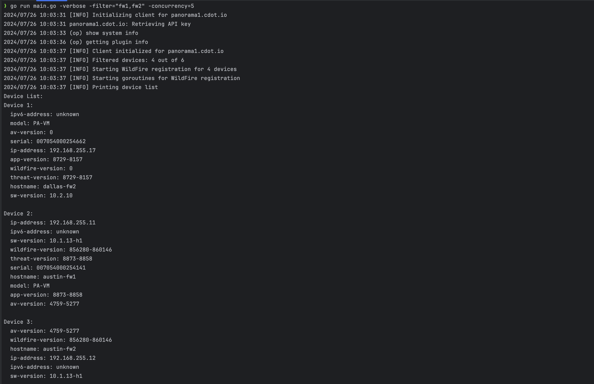
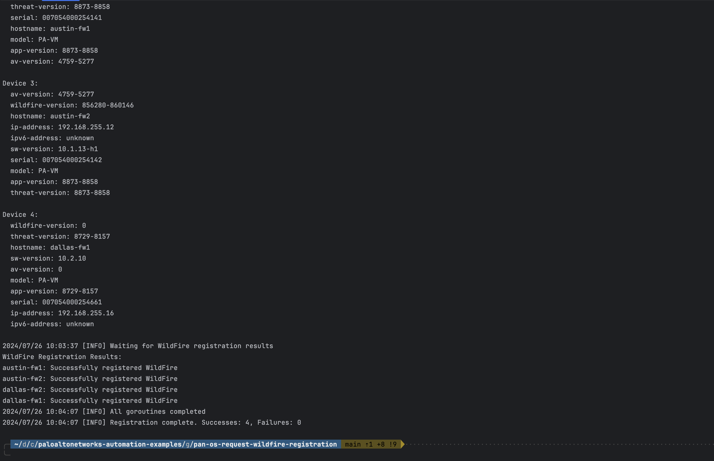
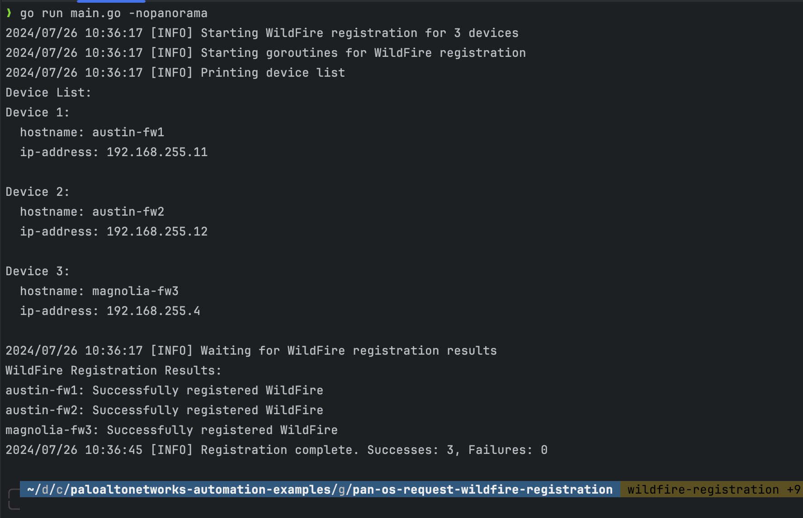

# PAN-OS CDSS Certificate Registration

This Go program automates the process of registering WildFire on Palo Alto Networks firewalls managed by Panorama or specified in a local inventory file.

## Table of Contents

- [Features](#features)
- [Prerequisites](#prerequisites)
- [Quick Start](#quick-start)
- [Run from Source](#run-from-source)
- [Configuration](#configuration)
- [Usage](#usage)
- [Inventory File](#inventory-file)
- [PDF Report Generation](#pdf-report-generation)
- [Output](#output)
- [Error Handling](#error-handling)
- [Contributing](#contributing)
- [License](#license)

## Features

- Connects to Panorama to retrieve a list of connected devices
- Optionally uses a local inventory file instead of querying Panorama
- Filters devices based on hostname patterns (when using Panorama)
- Concurrently registers WildFire on multiple firewalls
- Customizable concurrency level
- Verbose logging option for debugging
- Generates a PDF report of device status and WildFire registration results

## Prerequisites

- Access to a Panorama instance
   - *only required if not using a local inventory file*
- Credentials stored in a local YAML file

## Quick Start

1. Download the pre-compiled binary for your system from the [Releases](https://github.com/cdot65/pan-os-cdss-certificate-registration/releases) page. Go is not required to be installed if using the packaged binary.

   - macOS users with Intel CPUs: Use `pan-os-cdss-certificate-registration-darwin-amd64`
   - macOS users with Apple Silicon CPUs: Use `pan-os-cdss-certificate-registration-darwin-arm64`
   - Linux users: Use `pan-os-cdss-certificate-registration-linux-amd64`
   - Windows users: Use `pan-os-cdss-certificate-registration-windows-amd64.exe`

   > macOS devices have strict security guardrails around executing unsigned binaries, either search Google for a solution if you are blocked or consider running the project from the source code (below instructions).

2. Create the required configuration files:
   - `panorama.yaml` (if using Panorama)
   - `inventory.yaml` (if not using Panorama)
   - `.secrets.yaml`

3. Run the binary:

    ```
    ./pan-os-cdss-certificate-registration-<os>-<arch> [flags]
    ```

   Replace `<os>` and `<arch>` with your operating system and architecture.

Available flags:

- `-debug int`: Debug level: 0=INFO, 1=DEBUG (default 0)
- `-concurrency int`: Number of concurrent operations (default: number of CPUs)
- `-config string`: Path to the Panorama configuration file (default "panorama.yaml")
- `-secrets string`: Path to the secrets file (default ".secrets.yaml")
- `-filter string`: Comma-separated list of hostname patterns to filter devices (only works when querying Panorama)
- `-verbose`: Enable verbose logging
- `-nopanorama`: Use inventory.yaml instead of querying Panorama

## Run from Source

If you prefer to run from source or build your own binary, follow these steps:

1. Ensure you have Go 1.20 or higher installed.

2. Clone this repository:

    ```
    git clone https://github.com/cdot65/pan-os-cdss-certificate-registration.git
    cd pan-os-cdss-certificate-registration
    ```

3. Initialize the project:

    ```
    go mod init github.com/cdot65/pan-os-cdss-certificate-registration
    ```

4. Install the required dependencies:

    ```
    go mod tidy
    ```

5. Run the program directly:

    ```
    go run main.go [flags]
    ```

   Or, optionally build a binary for your system:

    ```
    go build main.go
    ```

   Then run the binary:

    ```
    ./main [flags]
    ```

## Configuration

1. Create a `panorama.yaml` file with your Panorama configuration:

    ```yaml
    panorama:
      - hostname: your-panorama-hostname
    ```

2. Create a `.secrets.yaml` file with your authentication details:

    ```yaml
    auth:
      panorama:
        username: your-panorama-username
        password: your-panorama-password
      firewall:
        username: your-firewall-username
        password: your-firewall-password
    ```

3. (Optional) If you would rather declare the firewall inventory without connecting to a Panorama appliance, create an `inventory.yaml` file with your firewall details:

    ```yaml
    inventory:
      - hostname: 'firewall-1'
        ip_address: '192.168.1.1'
      - hostname: 'firewall-2'
        ip_address: '192.168.1.2'
    ```

## Usage

Run the script with the following command:

```
./pan-os-cdss-certificate-registration [flags]
```

Examples:

1. Using Panorama with filtering:
   ```
   ./pan-os-cdss-certificate-registration -verbose -filter="fw1,fw2" -concurrency=5
   ```

2. Using local inventory file instead of Panorama:
   ```
   ./pan-os-cdss-certificate-registration -verbose -nopanorama
   ```

Note: When using the `-nopanorama` flag, the script will load firewall information from `inventory.yaml` instead of querying Panorama. In this case, the `-filter` flag has no effect.

## Inventory File

When using the `-nopanorama` flag, the script reads firewall information from `inventory.yaml`. This file should be in the following format:

```yaml
inventory:
  - hostname: 'firewall-1'
    ip_address: '192.168.1.1'
  - hostname: 'firewall-2'
    ip_address: '192.168.1.2'
  - hostname: 'firewall-3'
    ip_address: '192.168.1.3'
```

## PDF Report Generation

The program generates a PDF report containing detailed information about all devices, including their status and WildFire registration results. This report is saved as `device_report.pdf` in the current directory.

You can view an example of the generated PDF report [here](docs/assets/pdf/device_report.pdf).

## Output

The script will display:

1. A list of all devices (either from Panorama or the inventory file)
2. WildFire registration results for each device
3. A summary of successful and failed registrations

### Screenshots

Here are some screenshots showcasing the execution:

_initialize the project by building the binary_


_execute by simply pointing to the path of the binary file generated_




_bypass Panorama and use a statically defined inventory.yaml file as source of inventory_


## Error Handling

- The script will log errors for failed connections or registrations
- A timeout is set for each device registration to prevent indefinite hanging

## Contributing

Contributions are welcome! Please feel free to submit a Pull Request.

## License

This project is licensed under the MIT License - see the LICENSE file for details.