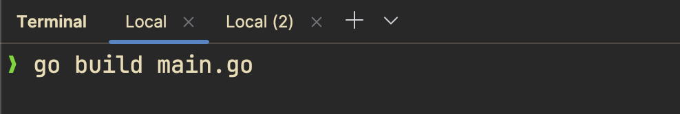
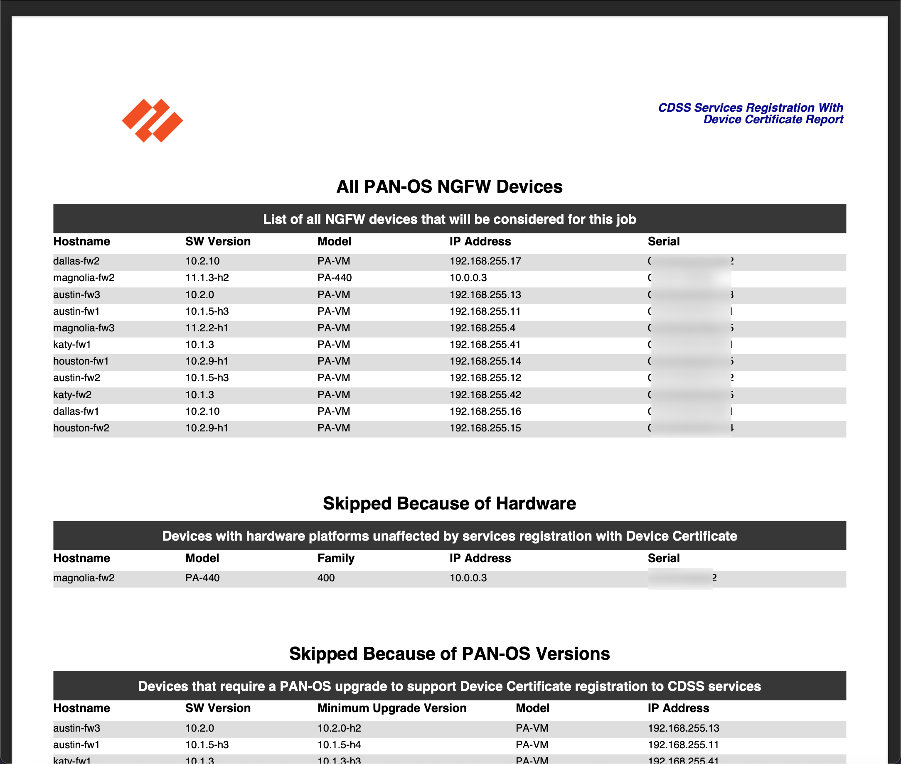

# PAN-OS CDSS Certificate Registration

This Go program automates the process of registering WildFire on Palo Alto Networks firewalls managed by Panorama or specified in a local inventory file.

## Table of Contents

- [Features](#features)
- [Prerequisites](#prerequisites)
- [Execution](#execution)
  - [Using the precompiled binary file](#using-the-precompiled-binary-file)
  - [Build binary from source](#building-from-source)
- [Required YAML Configuration Files](#required-yaml-configuration-files)
- [Available execution flags](#available-execution-flags)
  - [Examples](#examples)
- [PDF Report Generation](#pdf-report-generation)
- [Output](#output)
- [Error Handling](#error-handling)
- [Contributing](#contributing)
- [License](#license)

## Features

- Connects to Panorama to retrieve a list of connected devices
- Optionally uses a local inventory file instead of querying Panorama
- Filters devices based on hostname patterns (when using Panorama)
- Concurrently registers WildFire on multiple firewalls
- Customizable concurrency level
- Verbose logging option for debugging
- Generates a PDF report of device status and WildFire registration results

## Prerequisites

- Configuration parameters stored in local YAML files
  - *examples are provided in the root folder of this repository*
- Access to a Panorama instance
   - *only required if you're not using a local inventory file*
- Go version 1.21+ installed
   - *only required if you're not using the precompiled binaries in the Releases page*

## Execution

You have two modes of executing this project:

1. use the pre-compiled binaries for your operating system (easiest)
2. build the binary from source code (requires Go installed)

### Using the precompiled binary file

1. Download the pre-compiled binary for your system from the [Releases](https://github.com/cdot65/pan-os-cdss-certificate-registration/releases) page. Go is not required to be installed if using the packaged binary.

   - 
   - 

   - macOS users with Intel CPUs: Use `pan-os-cdss-certificate-registration-darwin-amd64`
   - macOS users with Apple Silicon CPUs: Use `pan-os-cdss-certificate-registration-darwin-arm64`
   - Linux users: Use `pan-os-cdss-certificate-registration-linux-amd64`
   - Windows users: Use `pan-os-cdss-certificate-registration-windows-amd64.exe`

2. Create the required configuration files:

   - [`.secrets.yaml`](.secrets.example.yaml) will host your username and password to authenticate
   

   - [`panorama.yaml`](panorama.yaml) will host your Panorama IP address or hostname if you're using Panorama
   
   
   - [`inventory.yaml`](inventory.yaml) will host your firewall inventory if you're not using Panorama

3. Run the binary:

   Replace `<os>` and `<arch>` with your operating system and architecture.

   - Change into the directory with your downloaded binary and your YAML configuration files
   

   - Execute the binary `./pan-os-cdss-certificate-registration-<os>-<arch> [flags]`
   

   - > If you're running macOS, you may find that your computer will block the binary's execution, even if you permit it. In this scenario, your best option is to [install Go](https://go.dev/doc/install) and build from source (instructions below).

   _macOS security may block your execution_
   

### Building from source

1. _Make sure you have Go installed and available from the CLI_

   - Run the command `go version` to make sure Go is installed and discovered by your machine.
   

2. _Clone the repository on your local machine (requires git to be installed!)_

   - Run the command `git version` to make sure git is installed and discovered by your machine.
   

   - Run the command `git clone https://github.com/cdot65/pan-os-cdss-certificate-registration.git` to pull down the source code to your local machine.
   

3. _Change into the project's directory, update YAML configuration files._

   - Update the `.secrets.yaml` file by renaming the `.secrets.example.yaml` and updating its contents
   

   - If you're using Panorama for the device inventory, update the `panorama.yaml` file contents
   

   - If you're not using Panoram then update the `inventory.yaml` file contents
   

4. _Initialize the Go project_

   - Initialize with `go mod init github.com/cdot65/pan-os-cdss-certificate-registration`
   

   - Download the dependencies with `go mod tidy`
   

   - Build binary with `go build main.go`
   

5. _Execute_

   - Execute without any flags with `./main`
   

   - Execute with any flags, example `./main -filter='dallas-fw1,dallas-fw2' -verbose`
   

## Required YAML Configuration Files

1. Create a `panorama.yaml` file with your Panorama configuration:

    ```yaml
    panorama:
      - hostname: your-panorama-hostname
    ```

2. Create a `.secrets.yaml` file with your authentication details:

    ```yaml
    auth:
      panorama:
        username: your-panorama-username
        password: your-panorama-password
      firewall:
        username: your-firewall-username
        password: your-firewall-password
    ```

3. (Optional) If you would rather declare the firewall inventory without connecting to a Panorama appliance, create an `inventory.yaml` file with your firewall details:

    ```yaml
    inventory:
      - hostname: 'firewall-1'
        ip_address: '192.168.1.1'
      - hostname: 'firewall-2'
        ip_address: '192.168.1.2'
    ```

## Available execution flags

- `-debug int`: Debug level: 0=INFO, 1=DEBUG (default 0)
- `-concurrency int`: Number of concurrent operations (default: number of CPUs)
- `-config string`: Path to the Panorama configuration file (default "panorama.yaml")
- `-secrets string`: Path to the secrets file (default ".secrets.yaml")
- `-filter string`: Comma-separated list of hostname patterns to filter devices (only works when querying Panorama)
- `-verbose`: Enable verbose logging
- `-nopanorama`: Use inventory.yaml instead of querying Panorama
- `-reportonly`: Generate the PDF report without performing the Wildfire registration command


### Examples:

1. Using Panorama with filtering:
   ```
   ./main -verbose -filter="fw1,fw2" -concurrency=5
   ```

2. Using local inventory file instead of Panorama:
   ```
   ./main -verbose -nopanorama
   ```

   > Note: When using the `-nopanorama` flag, the script will load firewall information from `inventory.yaml` instead of querying Panorama. In this case, the `-filter` flag has no effect.
   
## PDF Report Generation

The program generates a PDF report containing detailed information about all devices, including their status and WildFire registration results. This report is saved as `device_report.pdf` in the current directory.



You can view an example of the generated PDF report [here](docs/assets/pdf/device_report.pdf).

## Output

The script will display:

1. A list of all devices (either from Panorama or the inventory file)
2. WildFire registration results for each device
3. A summary of successful and failed registrations

## Error Handling

- The script will log errors for failed connections or registrations
- A timeout is set for each device registration to prevent indefinite hanging

## Contributing

Contributions are welcome! Please feel free to submit a Pull Request.

## License

This project is licensed under the MIT License - see the LICENSE file for details.